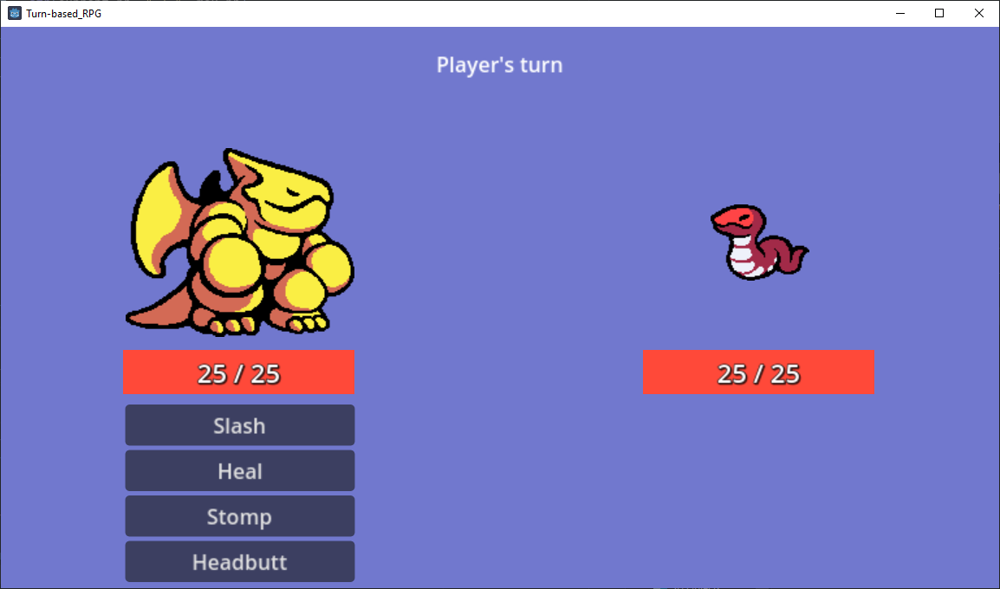
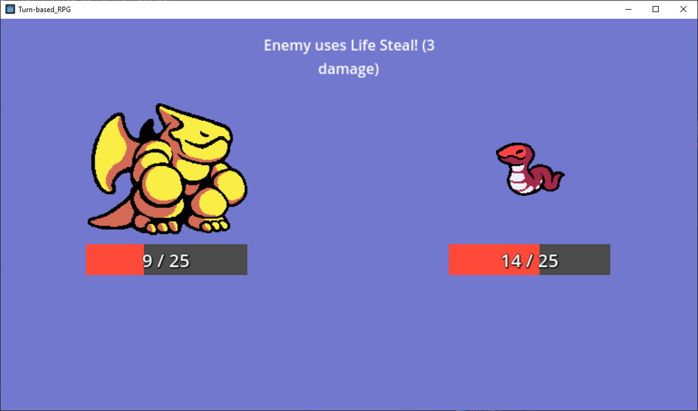

# Turn-based RPG  

A turn-based microgame written in Godot 4. In this game, you can select moves that your character uses to attack an enemy, 
who either fights back or heals themself in return. The game ends when the player or enemy is defeated.

## Screenshots  

  

  

## Installation  
Either clone the repo and build the project yourself using the Godot editor (v4.0.1 stable or higher) or download and unzip one of the pre-built releases.  

## License  
This project is open-source under the MIT License.  
